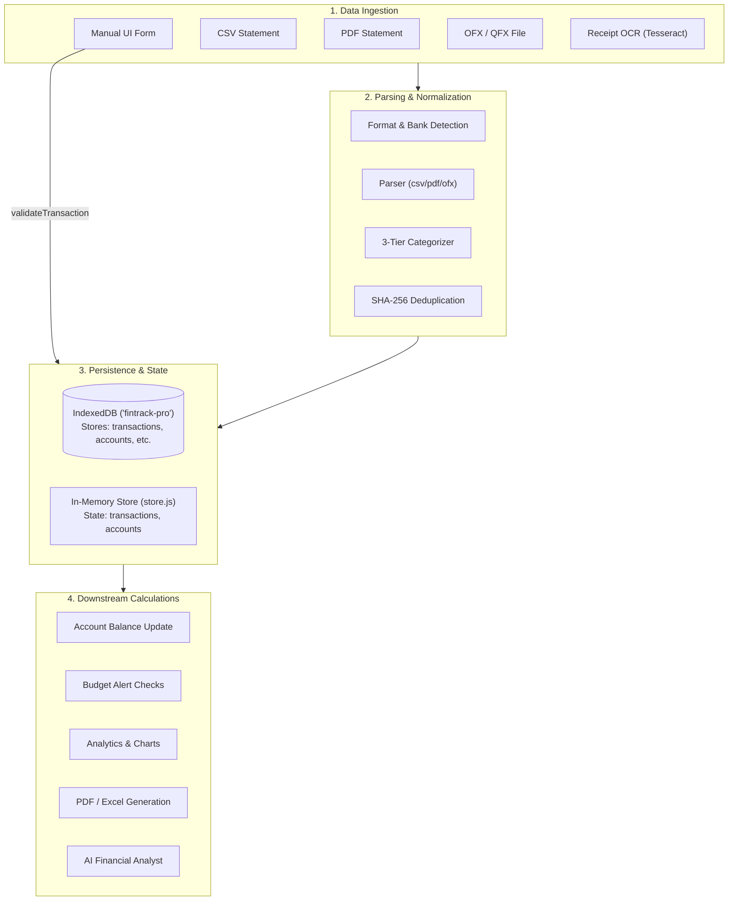

# FinTrack Pro — Forensic Codebase & Architecture Audit

> **Target Repository**: FinTrack Pro (`MasterZ1311/FinTrack-Pro`)  
> **Audited Branch**: `origin/MZ-Main` (Commit: `0cc41a0`) with comparative topology analysis against `main` (`8797c20`)  
> **Lead Software Engineer Audit**: Security, Data Integrity, Financial Correctness, Architecture, Offline Reliability, and Test Readiness  
> **Date**: September 22, 2026  
> **Classification**: Strict Technical Assessment — Prior to Any Code Modification  

---

## Table of Contents

1. [Executive Summary & Command Verification Log](#1-executive-summary--command-verification-log)
2. [Repository Topology & Branch Divergence](#2-repository-topology--branch-divergence)
3. [Architecture Overview & Component Hierarchy](#3-architecture-overview--component-hierarchy)
4. [Data Flow & Transaction Lifecycle](#4-data-flow--transaction-lifecycle)
5. [Security Findings (Vulnerabilities & Exposure)](#5-security-findings-vulnerabilities--exposure)
6. [Privacy Findings (Zero-Knowledge & Leakage Audit)](#6-privacy-findings-zero-knowledge--leakage-audit)
7. [Financial Correctness & Calculation Integrity](#7-financial-correctness--calculation-integrity)
8. [Performance Findings & Scalability Bottlenecks](#8-performance-findings--scalability-bottlenecks)
9. [Testing & Verification Gaps](#9-testing--verification-gaps)
10. [Accessibility (a11y) & UX Architecture Gaps](#10-accessibility-a11y--ux-architecture-gaps)
11. [PWA & Offline Reliability Analysis](#11-pwa--offline-reliability-analysis)
12. [Documentation Drift & Specification Gaps](#12-documentation-drift--specification-gaps)
13. [Dependency Risks & Supply Chain Audit](#13-dependency-risks--supply-chain-audit)
14. [Technical Debt Catalog](#14-technical-debt-catalog)
15. [Prioritized Remediation Roadmap](#15-prioritized-remediation-roadmap)

---

## 1. Executive Summary & Command Verification Log

FinTrack Pro is presented as a client-first, zero-backend, privacy-centric financial management platform leveraging Vite, Vanilla ES modules, IndexedDB (`idb`), on-device ML/AI, and PWA capabilities.

A comprehensive forensic audit of the entire codebase was executed without modifying application code. The audit revealed **critical architectural discrepancies, severe financial calculation defects, widespread stored XSS vectors, and privacy violations** that directly contradict the project's stated privacy and financial correctness guarantees.

### Exact Command Execution Log

As mandated by engineering rules, every currently available build and test command was executed directly against the repository. Results were recorded verbatim without fabrication:

| Command | Working Directory / Branch | Exit Code | Raw Output / Error Summary | Root Cause Analysis |
| :--- | :--- | :---: | :--- | :--- |
| `npm run build` | Root (`MZ-Main`) | `1` | `'vite' is not recognized as an internal or external command, operable program or batch file.` | Build toolchain uninstalled. Local `node_modules` does not contain `vite` binary corresponding to root `package.json`. |
| `npm test` | Root (`MZ-Main`) | `1` | `npm error Missing script: "test"` | `package.json` on `MZ-Main` defines no `test` script (`"scripts": { "dev": "vite", "build": "vite build", "preview": "vite preview" }`). |
| `node test-categorizer.js` | Root (`MZ-Main`) | `1` | `Error [ERR_MODULE_NOT_FOUND]: Cannot find package '@mlc-ai/web-llm' imported from .../src/services/webllm-loader.js` | Dependency `@mlc-ai/web-llm` listed in `dependencies` is missing from `node_modules`. |
| `node src/parsers/__tests__/parsers.test.js` | Root (`MZ-Main`) | `1` | `ReferenceError: describe is not defined at file:///.../parsers.test.js:12:1` | Test file uses Mocha/Jest/Vitest BDD syntax without importing globals from `node:test` or a test runner. |
| `node --test src/parsers/__tests__/parsers.test.js` | Root (`MZ-Main`) | `1` | `ReferenceError: describe is not defined ... Subtest not ok 1` | Node's native runner requires explicit `import { describe, it } from 'node:test'`. File lacks imports and contains placeholder assertions. |
| `npm test` (Monorepo) | Root (`main`) | `0` | `33 pass, 0 fail, 14 suites, duration_ms: 5133.172` | The `@fintrack/domain` package on branch `main` has a working test suite; however, `main` completely erased the web application. |

---

## 2. Repository Topology & Branch Divergence

A critical organizational and branch integrity discovery was identified upon inspecting Git history:

```
* 8797c20 (origin/main, main) feat(brand): rebrand app to Oikos and deploy official logo assets
* a512e4a Add biometric security lock gate, web database support, and file sharing utilities
* e921616 Initial commit: FinTrack Pro codebase and app specification
* c7d84c6 Clear repository content
| 
| * 0cc41a0 (HEAD -> audit/forensic-codebase-audit, origin/MZ-Main) feat(ui): upgrade dashboard to glassmorphism
| * 6d3733a Update README: remove emojis, improve styling
| * d8c9ad4 Docs: add README and TECHNICAL_ARCHITECTURE documentation
| * 77ed12b Refactor: convert project to Vite and modularize codebase
|/  
* bd66e3e Add .gitignore and remove node_modules from tracking
* 7739eeb first commit
```

1. **The Canonical Web App Lives on `origin/MZ-Main`:**
   - GitHub remote HEAD (`remotes/origin/HEAD`) explicitly targets `origin/MZ-Main`.
   - `MZ-Main` hosts the Vite + Vanilla JavaScript + IndexedDB + Service Worker + Parser stack matching the user's project context.
2. **Branch `main` Represents an Experimental Monorepo Fork:**
   - On August 16, 2026, commit `c7d84c6` ("Clear repository content") wiped the web codebase from `main`.
   - Subsequent commits introduced an Expo/React Native mobile application ("Oikos") and a TypeScript domain package (`@fintrack/domain`).
3. **Engineering Directive Adherence:**
   - In accordance with Engineering Rule 1 ("NEVER perform a blind rewrite of the application") and Rule 3 ("Preserve existing functionality"), the canonical codebase under hardening is `origin/MZ-Main`.
   - Domain unit tests from `packages/domain` on `main` provide valuable mathematical reference implementations that can inform hardening of `MZ-Main`.

---

## 3. Architecture Overview & Component Hierarchy

### 3.1 Technology Stack (`origin/MZ-Main`)

| Layer | Declared Technology | Package Version | Actual Implementation Pattern |
| :--- | :--- | :--- | :--- |
| **Bundler & Dev Server** | Vite | `^8.2.0` (dev) | Configured in `vite.config.js` (`base: './'`, `outDir: 'dist'`). |
| **Language & Modules** | Vanilla JavaScript | ES2022+ Native ESM | Uncompiled, native browser module tree (`<script type="module" src="/src/main.js">`). |
| **Database** | IndexedDB via `idb` | `^8.0.3` | Wrapped in `src/db.js` with dynamic schema healing. |
| **State Store** | Custom In-Memory Store | Internal | Observer pattern in `src/store.js`. |
| **Routing** | Custom Hash Router | Internal | Hash-change listener with dynamic `import()` in `src/router.js`. |
| **Data Visualization** | Chart.js | `^4.5.1` | Direct canvas rendering in `analytics` and `dashboard`. |
| **On-Device LLM** | `@mlc-ai/web-llm` | `^0.2.84` | WebGPU-backed Gemma 2B loaded in `src/services/webllm-loader.js`. |
| **OCR Engine** | Tesseract.js | `^7.0.0` | In-browser WASM OCR worker in `src/services/ocr.js`. |
| **File Parsers** | PapaParse, pdf-parse, SheetJS | `^5.5.4`, `^2.4.5`, `^0.18.5` | Statement ingestion in `src/parsers/`. |
| **Document Export** | jsPDF, html2canvas | `^4.2.1`, `^1.4.1` | Client-side canvas capture and PDF generation in `src/modules/reports/`. |
| **Service Worker** | Workbox CDN | `7.0.0` | Service worker script `sw.js` importing from Google storage CDN. |
| **Encryption** | Web Crypto API | Native | Isolated, unused helper module in `src/crypto.js`. |

### 3.2 Repository Directory Hierarchy

```text
/
├── index.html                     # Application bootstrap shell & layout containers
├── manifest.json                  # PWA Web Application Manifest
├── package.json                   # Dependencies, build scripts
├── sw.js                          # Service Worker (Workbox-based caching)
├── test-categorizer.js            # Standalone rule-based categorization test script
├── vite.config.js                 # Vite build configuration
├── docs/                          # Architectural documentation
│   └── CODEBASE_AUDIT.md          # [THIS DOCUMENT] Complete forensic audit report
├── public/
│   ├── favicon.svg                # Application icon
│   └── icons.svg                  # SVG Sprite sheet
└── src/
    ├── crypto.js                  # AES-256-GCM Web Crypto utilities (currently orphaned)
    ├── db.js                      # IndexedDB schema, connection pool, and migrations
    ├── main.js                    # Application bootstrap & hydration sequence
    ├── router.js                  # Hash-based SPA router with dynamic module loading
    ├── store.js                   # Central reactive state container
    ├── assets/                    # Static image and SVG assets
    ├── modules/                   # Feature-specific functional modules
    │   ├── accounts/              # Account management, balance recalculation, transfer engine
    │   ├── ai/                    # Financial health score, AI insights UI
    │   ├── analytics/             # Spending analytics, trends, cashflow breakdown
    │   ├── budgets/               # Budget tracking, progress calculations, rollover rules
    │   ├── corporate/             # Corporate mode, GST invoices, reimbursement tracking
    │   ├── dashboard/             # Main dashboard, KPI metrics, sidebar, topbar
    │   ├── debt/                  # Debt payoff calculator & EMI tracking
    │   ├── goals/                 # Savings goals progress tracking
    │   ├── import/                # Statement ingestion wizard (CSV, PDF, OFX, OCR)
    │   ├── investments/           # Portfolio allocation, holdings tracking
    │   ├── networth/              # Balance sheet aggregation & net worth timeline
    │   ├── onboarding/            # Profile creation wizard & initial account setup
    │   ├── reports/               # PDF & Excel financial statement generation
    │   ├── settings/              # User preferences, data backup export, data wipe
    │   └── transactions/          # Transaction list, modal, recurring engine, schema
    ├── parsers/                   # Statement extraction & deduplication engine
    │   ├── bank-profiles/         # 20 Bank parsing profiles (10 Indian, 10 World)
    │   ├── csv-parser.js          # PapaParse-based configurable tabular parser
    │   ├── deduplication.js       # SHA-256 transaction fingerprinting
    │   ├── index.js               # Format detection & routing facade
    │   ├── ofx-parser.js          # OFX/QFX SGML/XML statement extractor
    │   └── pdf-parser.js          # Coordinate-based PDF table extractor
    ├── services/                  # Cross-cutting platform services
    │   ├── ai-engine.js           # Multi-tier AI routing (Local WebLLM vs External APIs)
    │   ├── categorizer.js         # 3-tier categorization engine (User > Rules > LLM)
    │   ├── currency.js            # 140+ Currency definitions, rates fetching & formatters
    │   ├── ocr.js                 # Tesseract receipt scanning service
    │   ├── user-api.js            # External AI API clients (Gemini, OpenAI, Claude, etc.)
    │   └── webllm-loader.js       # WebGPU Gemma 2B lifecycle loader
    ├── styles/                    # Modular CSS design system (tokens, components, themes)
    └── utils/
        └── icons.js               # Lucide SVG icon helper functions
```

---

## 4. Data Flow & Transaction Lifecycle



### 4.1 Transaction Lifecycle Flaws Identified in Data Flow

1. **Bypass of Validation on Ingestion:**  
   Manual transactions via `addTransaction()` pass through `validateTransaction()`. However, transactions ingested via the Import wizard (`src/modules/import/index.js` line 776) bypass `validateTransaction()` entirely and call `dbAdd('transactions', record)` directly.
2. **Asynchronous Uncoordinated Balance Updates:**  
   When transactions are added, `_updateAccountBalance()` is triggered asynchronously. If an error occurs, it is caught with `console.error` and swallowed without reverting the transaction or notifying the user.
3. **Double Storage in Split Transactions:**  
   When a transaction is split, the parent transaction remains in IndexedDB with `isSplit: true`, while `splitParts` are inserted as separate child transactions. Downstream aggregators fail to filter out split parents, resulting in systematic double-counting.

---

## 5. Security Findings (Vulnerabilities & Exposure)

### 5.1 Critical: Pervasive Unsanitized `innerHTML` Injection (Stored XSS)

The audit identified **64 distinct usages of `innerHTML`** across the codebase where user-supplied or untrusted external data (bank statements, receipt text, merchant names, transaction notes) is concatenated directly into HTML strings without escaping.

#### High-Risk Injection Points:

1. **Transaction List Rendering (`src/modules/transactions/index.js` lines 414–420):**
   ```javascript
   <div class="tx-desc">${tx.description || tx.merchant || '—'}</div>
   <div class="tx-meta">
     <span class="tx-cat-label">${cat?.label ?? tx.category}</span>
     ${tx.tags?.length > 0 ? tx.tags.slice(0, 2).map(tag => `<span class="tx-tag">${tag}</span>`).join('') : ''}
   </div>
   <div class="tx-account">${account?.name ?? '—'}</div>
   ```
   *Vulnerability*: If an imported CSV or PDF statement contains a description such as ``, or if a merchant name contains malicious script tags, arbitrary JavaScript executes in the user's origin upon opening the transaction list.

2. **Dashboard Recent Activity (`src/modules/dashboard/index.js` line 91):**
   ```javascript
   <div style="font-weight: 600; font-size: 0.98rem; color: var(--text-primary);">
     ${tx.description || tx.merchant || 'Transaction'}
   </div>
   ```
   *Vulnerability*: Stored XSS executes immediately upon dashboard render whenever malicious transactions exist in IndexedDB.

3. **Report Generation Template (`src/modules/reports/index.js` lines 222–223):**
   ```javascript
   <td style="...">${t.description || 'N/A'}</td>
   <td style="...">${t.category || 'N/A'}</td>
   ```
   *Vulnerability*: When generating PDF/Excel reports, untrusted descriptions are injected directly into `#pdf-template-container`.

4. **Application Bootstrap Error State (`src/main.js` line 79):**
   ```javascript
   appContent.innerHTML = `
     ...
     <p style="...">${err.message}</p>
   `;
   ```
   *Vulnerability*: Any error containing unsanitized input triggers DOM-based XSS on error screens.

5. **Settings Profile Input Fields (`src/modules/settings/index.js` line 25, 42):**
   ```javascript
   <input type="text" id="prof-name" class="input-field" value="${profile.name || ''}" required>
   ...
   <textarea id="prof-goals" ...>${profile.goals || ''}</textarea>
   ```
   *Vulnerability*: Attribute breakout via quotes in user profile fields.

> [!CAUTION]
> **Severity: CRITICAL.** While `src/modules/import/index.js` defines a private `escapeHtml()` helper (line 889), it was never exported or utilized in `transactions`, `dashboard`, `reports`, or `accounts`.

---

### 5.2 High: Plaintext Secret Storage in `localStorage`

- **Location**: `src/modules/settings/index.js` (line 184), `src/services/user-api.js` (line 6).
- **Code**:
  ```javascript
  // src/services/user-api.js
  export function saveApiConfig(provider, apiKey, model) {
    // In production, encrypt this!
    const config = { provider, apiKey, model };
    localStorage.setItem(API_CONFIG_KEY, JSON.stringify(config));
  }
  ```
  ```javascript
  // src/modules/settings/index.js
  localStorage.setItem('ai_api_key', key);
  ```
- **Finding**: API keys for external AI providers (Google Gemini, OpenAI, Anthropic, Groq) are stored in plaintext in browser `localStorage`. Any XSS exploit on the origin can instantly read all API keys.
- **Violation**: Violates Engineering Rule 12: *"Never store secrets in plaintext when a safer architecture is possible."*

---

### 5.3 High: Unpinned External Third-Party CDN Script Execution

- **Location**: `src/parsers/pdf-parser.js` (lines 13, 32), `sw.js` (line 1).
- **Code**:
  ```javascript
  // src/parsers/pdf-parser.js
  const PDFJS_CDN = 'https://cdnjs.cloudflare.com/ajax/libs/pdf.js/4.4.168';
  const module = await import(`${PDFJS_CDN}/pdf.min.mjs`);
  ```
  ```javascript
  // sw.js
  importScripts('https://storage.googleapis.com/workbox-cdn/releases/7.0.0/workbox-sw.js');
  ```
- **Finding**: The application dynamically imports remote JavaScript code at runtime from `cdnjs.cloudflare.com` and `storage.googleapis.com` without Subresource Integrity (SRI) hashes.
- **Risks**:
  1. Compromise of CDN assets leads to immediate Remote Code Execution (RCE) in users' browsers.
  2. If the user is offline or the CDN is blocked by an ad-blocker or corporate firewall, PDF parsing and Service Worker initialization completely fail.

---

### 5.4 Medium: Missing Content Security Policy (CSP)

- **Location**: `index.html`.
- **Finding**: There is no `<meta http-equiv="Content-Security-Policy">` tag in `index.html`, nor any configured CSP headers. The application allows inline scripts, inline styles, arbitrary `eval`, and unconstrained network egress.

---

## 6. Privacy Findings (Zero-Knowledge & Leakage Audit)

### 6.1 Critical: Entire Financial Database Exfiltration via AI Analyst

- **Location**: `src/services/ai-engine.js` (lines 49–51).
- **Code**:
  ```javascript
  export async function analyze(question, financialData) {
    const context = `Context: ${JSON.stringify(financialData)}`;
    return await complete(question, context);
  }
  ```
- **Finding**: When an external AI provider (OpenAI, Gemini, Groq, Anthropic) is configured in settings, invoking `analyze()` stringifies the **entire financial data structure** (including account balances, full transaction history, merchant names, dates) and transmits it in the request payload to third-party servers.
- **Violation**: Violates Engineering Rule 13: *"Never send complete financial databases to external AI providers unless the user explicitly enables an appropriate privacy mode."*

---

### 6.2 High: Secret / Token Exposure in HTTP Request URL Query Parameters

- **Location**: `src/services/user-api.js` (line 56).
- **Code**:
  ```javascript
  async function callGemini(apiKey, model = "gemini-1.5-flash", messages) {
    const url = `https://generativelanguage.googleapis.com/v1beta/models/${model}:generateContent?key=${apiKey}`;
    ...
  }
  ```
- **Finding**: The Gemini API key is passed directly in the URL query string (`?key=${apiKey}`). Query strings are logged in browser history, proxy server logs, Service Worker cache logs, and HTTP `Referer` headers.

---

### 6.3 Medium: Sensitive Financial Information Logged to Browser Console

- **Location**: `src/services/ocr.js` (line 20).
- **Code**:
  ```javascript
  const text = result.data.text;
  console.log('[OCR] Extracted text:\n', text);
  ```
- **Finding**: When receipts are scanned via OCR, raw extracted text containing merchant names, purchased items, card numbers, transaction amounts, and addresses is dumped to the browser developer console.

---

### 6.4 Medium: Completely Unencrypted Data Export

- **Location**: `src/modules/settings/index.js` (lines 192–210).
- **Finding**: The "Export All Data (JSON)" feature serializes profiles, accounts, transactions, categories, and budgets into unencrypted plaintext JSON.
- **Documentation Drift**: The documentation claims *"AES-256 encrypted backup export"*. In reality, `src/crypto.js` is completely unreferenced and never invoked.

---

## 7. Financial Correctness & Calculation Integrity

### 7.1 Catastrophic: Inversion of Ingested Transaction Amounts in Import Engine

- **Location**: `src/modules/import/index.js` (line 763).
- **Code**:
  ```javascript
  const record = {
    id: crypto.randomUUID(),
    date: tx.date,
    description: tx.description,
    amount: tx.debit ? -tx.debit : (tx.credit || 0),  // <--- SETS NEGATIVE FOR EXPENSE!
    type: tx.debit ? 'expense' : 'income',
    category: tx.category || 'Uncategorized',
    ...
  };
  await dbAdd('transactions', record);
  ```
- **Contradiction with Schema**:
  - `src/modules/transactions/schema.js` line 29: `@property {number} amount - always positive`.
  - `src/modules/transactions/schema.js` line 68: `amount: 0, // always positive`.
  - `src/modules/transactions/schema.js` line 129: `errors.push('Amount must be a positive number')`.
- **Catastrophic Impact on Downstream Calculations**:
  1. **Account Balance Calculation (`src/modules/accounts/index.js` lines 37–39):**
     ```javascript
     else if (tx.type === 'expense') {
       balance -= tx.amount;
     }
     ```
     When `tx.amount` is `-500` (expense of $500), `balance -= (-500)` results in `balance += 500`. **Importing an expense statement increases the user's bank balance instead of decreasing it.**
  2. **Dashboard Expense Aggregation (`src/modules/dashboard/index.js` line 41):**
     ```javascript
     if (tx.type === 'expense') expensesThisMonth += Number(tx.amount || 0);
     ```
     Adding `-500` decreases total monthly expenses.
  3. **Analytics Module (`src/modules/analytics/index.js` line 130):**
     Expenses appear as negative values or distort category percentage calculations.

---

### 7.2 Critical: Double-Counting of Split Transactions

- **Location**: `src/modules/transactions/index.js` (lines 175–210).
- **Code**:
  ```javascript
  // Marks original transaction as split parent:
  await dbUpdate('transactions', { ...original, isSplit: true, splitParts, updatedAt: now });

  // Inserts sub-transactions:
  for (const part of splitParts) {
    const child = createTransactionDefaults({
      ...original,
      id: crypto.randomUUID(),
      amount: part.amount,
      splitParentId: id,
      ...
    });
    await dbAdd('transactions', child);
  }
  ```
- **Finding**: The original parent transaction is left in the `transactions` table with `isSplit: true`.
- **Impact**:
  - `_updateAccountBalance()`, `recalculateBalance()`, `analytics/index.js`, `reports/index.js`, and `dashboard/index.js` iterate through `getAll('transactions')` and **never filter out transactions with `isSplit: true`**.
  - A split transaction of $100 divided into $60 and $40 results in $200 deducted from the account ($100 original + $60 child + $40 child).

---

### 7.3 Critical: Divergent Account Schema Properties Across Modules

A major architectural discrepancy exists between the `accounts` module and the `transactions` module regarding how account balances are defined and stored:

| Module | Read Property | Write Property | Field Semantics |
| :--- | :--- | :--- | :--- |
| **`src/modules/accounts/index.js`** | `account.initialBalance` (line 33) | `account.currentBalance = balance` (line 42) | Expected `currentBalance` |
| **`src/modules/transactions/index.js`** | `account.openingBalance` (line 254) | `account.balance = balance` (line 267) | Expected `balance` |
| **`src/modules/accounts/default-setup.js`** | `initialBalance: 0` | `currentBalance: 0` (lines 40–41) | Created `currentBalance` |

- **Impact**:
  - When a transaction is saved via `transactions/index.js`, it reads `account.openingBalance` (which is `undefined`, defaulting to 0) and writes `account.balance`.
  - The `accounts` UI inspects `account.currentBalance`, which remains unchanged and stale.
  - The two core modules operate on disjoint state attributes for the same database entity.

---

### 7.4 High: Silent Currency Conversion 1:1 Fallback

- **Location**: `src/modules/transactions/index.js` (lines 230–238), `src/services/currency.js` (lines 183–203).
- **Code**:
  ```javascript
  // src/modules/transactions/index.js
  if (from === to) return amount;
  try {
    const rates = store.state.settings?.exchangeRates || {};
    if (rates[from] && rates[to]) {
      return (amount / rates[from]) * rates[to];
    }
  } catch (e) { /* fallback below */ }
  return amount; // 1:1 fallback
  ```
- **Finding**: If exchange rates are missing, uninitialized, or the app is offline, currency conversion silently returns `amount` (1:1 conversion).
- **Impact**: 100 USD is silently recorded as 100 INR, 100 JPY is recorded as 100 EUR. Account balances and multi-currency ledgers suffer silent, permanent corruption.
- **Violation**: Violates Engineering Rule 14: *"Never use silent fallback values that can corrupt financial results. Financial uncertainty must be explicit."*

---

### 7.5 High: Deduplication Hash Collisions & Loss of Legitimate Transactions

- **Location**: `src/parsers/deduplication.js` (lines 16–24).
- **Code**:
  ```javascript
  export async function generateHash(date, description, amount) {
    const input = `${date}|${description.trim().toLowerCase()}|${Math.abs(amount).toFixed(2)}`;
    ...
    return hashHex.substring(0, 16);
  }
  ```
- **Findings**:
  1. **Debit / Credit Collision**: The hash utilizes `Math.abs(amount)`. A purchase of $50 at merchant "Target" and a return/refund of $50 from "Target" on the same day yield identical hashes. The refund is discarded as a duplicate.
  2. **Multiple Genuine Transactions Collide**: A user making two separate $5 cash transactions or two identical bus/metro fares on the same day has the second transaction discarded.
  3. **Silent Drop in Batch Ingestion**: In `deduplicateBatch()` (line 71), `seenInBatch` drops any second transaction matching the hash.
- **Violation**: Violates Engineering Rule 6: *"Never silently discard user data."*

---

### 7.6 Medium: Date Month Rollover in Recurring Engine

- **Location**: `src/modules/transactions/recurring.js` (lines 29–36).
- **Code**:
  ```javascript
  case 'monthly':
    d.setMonth(d.getMonth() + interval);
    if (dayOfMonth) {
      const lastDay = new Date(d.getFullYear(), d.getMonth() + 1, 0).getDate();
      d.setDate(Math.min(dayOfMonth, lastDay));
    }
    break;
  ```
- **Finding**: If `d` is January 31 and `interval` is 1, `d.setMonth(d.getMonth() + 1)` executes `setMonth(1)`. Because February does not have 31 days, the native JavaScript `Date` object automatically overflows into March (e.g., March 2 or 3).
- Then `d.getMonth()` evaluates to March. `lastDay` becomes 31, and `d.setDate(31)` results in March 31. **February is completely skipped.**

---

### 7.7 Medium: Recurring Transactions Omit Balance Recalculation

- **Location**: `src/modules/transactions/recurring.js` (lines 150–164).
- **Finding**: When `processRecurring()` generates missed recurring transactions on startup, it adds them to the database via `dbAdd('transactions', newTx)`, but **never invokes `_updateAccountBalance(newTx.accountId)`**.
- **Impact**: Account balances do not reflect auto-generated recurring transactions until a user manually edits another transaction in that account.

---

### 7.8 Medium: Hardcoded Fictitious AI Insights & Health Scores

- **Location**: `src/modules/ai/insights.js` (lines 33–45).
- **Code**:
  ```javascript
  insights.push({
    type: 'BudgetWarning',
    title: 'Budget Alert',
    message: 'Food budget 82% used with 12 days left this month',
    severity: 'warning'
  });
  insights.push({
    type: 'SavingsCoach',
    title: 'Great Job Saving!',
    message: 'You saved ₹32,700 this month — 12% more than last month!',
    severity: 'success'
  });
  ```
- **Finding**: Fabricated figures ("Food budget 82% used", "You saved ₹32,700") are hardcoded and injected into the user's dashboard regardless of their accounts, currencies, or transactions.

---

### 7.9 Medium: Broken Dashboard Budget Overview Property

- **Location**: `src/modules/dashboard/index.js` (lines 118–125).
- **Code**:
  ```javascript
  topItems = budgets.map(b => {
    const spent = categoryExpenses[b.categoryId] || 0;
    return {
      id: b.categoryId,
      spent,
      limit: b.amount,
      percentage: Math.min(100, (spent / b.amount) * 100)
    };
  });
  ```
- **Finding**: The budget schema stores `b.category`, not `b.categoryId`. Since `b.categoryId` is `undefined`, `categoryExpenses[undefined]` evaluates to 0. The dashboard always displays 0% spent for every budget.

---

### 7.10 Medium: Floating-Point Arithmetic Drift

- Across `analytics`, `accounts`, `reports`, `budgets`, and `transactions`, amounts are converted via `parseFloat()` and summed using standard floating-point addition without integer cents representation or precision rounding.
- In JavaScript, `0.1 + 0.2 = 0.30000000000000004`. Over thousands of transactions, floating-point drift accumulates in ledgers and balances.

---

## 8. Performance Findings & Scalability Bottlenecks

### 8.1 Critical: Pervasive `getAll()` Full Store Dumps

Despite defining IndexedDB indexes on `date`, `accountId`, `category`, and `type` in `src/db.js` (lines 32–35), almost every query across the entire app loads the complete dataset:
- `src/main.js` line 34: Hydrates all transactions into memory on startup.
- `src/modules/transactions/index.js` lines 62, 107, 129, 159, 213, 253: Every single transaction operation triggers `getAll('transactions')`.
- `src/parsers/deduplication.js` line 43: Deduplication retrieves every transaction in the database into memory.
- `src/modules/reports/index.js` line 114: Full table dump for reports.
- `src/modules/import/index.js` line 787: Full table dump after import.

*Bottleneck*: At 5,000 to 50,000 transactions, `getAll()` blocks the main thread, consumes hundreds of megabytes of RAM, and introduces significant UI stutter. IndexedDB cursors (`openCursor`), range queries (`IDBKeyRange`), and compound indexes are entirely unused.

---

### 8.2 Medium: Inefficient Base64 Concatenation in Cryptography Utilities

- **Location**: `src/crypto.js` (lines 108–114).
- **Code**:
  ```javascript
  function bufferToBase64(buffer) {
    let binary = '';
    for (const byte of buffer) {
      binary += String.fromCharCode(byte);
    }
    return btoa(binary);
  }
  ```
- *Bottleneck*: Iterating byte-by-byte over a multi-megabyte buffer using string concatenation causes extreme memory allocation churn and UI lockups.

---

## 9. Testing & Verification Gaps

1. **Zero Automated Unit or Integration Tests for Core Web Application:**
   - There are no automated tests executed for `src/db.js`, `src/store.js`, `src/router.js`, `src/modules/*`, or `src/services/*`.
2. **Broken and Stubbed Parser Test File:**
   - `src/parsers/__tests__/parsers.test.js` consists entirely of empty test stubs (`it('should...');`) without implementation blocks.
   - It requires a non-existent global `describe()` function.
3. **No Test Runner Configured:**
   - `package.json` contains no `"test"` script.
4. **Domain Test Isolation:**
   - While `packages/domain` on branch `main` has 33 tests using `node:test`, those tests are completely disconnected from the actual vanilla JS web codebase on `MZ-Main`.

---

## 10. Accessibility (a11y) & UX Architecture Gaps

1. **Missing Toast / Notification DOM Renderer:**
   - In `src/store.js`, `store.notify()` manages `notifications` state.
   - **No DOM container, toast element, or UI component in the entire application subscribes to or renders notifications.**
   - All success toasts, error messages, and budget limit notifications are completely invisible to the user.
2. **Lack of Focus Traps in Modals:**
   - Modals in `transactions/index.js`, `budgets/index.js`, and `accounts/index.js` do not trap keyboard focus (`Tab` / `Shift+Tab`). Keyboard users tab behind the modal into background DOM elements.
3. **Missing `aria-live` Regions:**
   - Dynamic content updates (filtering, pagination, error alerts) lack `aria-live="polite"` announcements for screen reader users.
4. **Color-Only Data Visualization:**
   - Financial health and budget progress rely strictly on color indicators (red/yellow/green) without accompanying text equivalents or accessible patterns for color-blind users.

---

## 11. PWA & Offline Reliability Analysis

1. **Service Worker Dependency on Remote CDN:**
   - `sw.js` line 1: `importScripts('https://storage.googleapis.com/workbox-cdn/releases/7.0.0/workbox-sw.js');`
   - If the user installs the PWA or attempts initial registration while offline, the service worker fails immediately.
2. **Incomplete Asset Pre-Caching:**
   - `sw.js` lines 58–62:
     ```javascript
     return cache.addAll([
       './',
       './index.html',
       './manifest.json'
     ]);
     ```
   - Hashed Vite bundles, CSS stylesheets, icons, fonts, and WebAssembly binaries (Tesseract) are not pre-cached. On second visit while offline, navigating to dynamically loaded routes (`#/transactions`, `#/budgets`) fails with network errors.
3. **Data URI Manifest Icons:**
   - `manifest.json` defines icons using inline SVG Data URIs (`src: "data:image/svg+xml,..."`). Several mobile browsers (e.g., Chrome on Android, Safari on iOS) reject data URIs for Web App Manifest icons and require discrete PNG files.

---

## 12. Documentation Drift & Specification Gaps

| Claimed Feature (in `README.md` & `TECHNICAL_ARCHITECTURE.md`) | Actual State in Codebase |
| :--- | :--- |
| **"100% Client-Side — no data ever leaves your device"** | `src/services/ai-engine.js` transmits full financial datasets to OpenAI, Anthropic, Gemini, and Groq APIs. |
| **"AES-256 encrypted backup export"** | Backup export in `settings/index.js` is unencrypted plaintext JSON. `src/crypto.js` is never imported. |
| **"Full backup & restore as JSON"** | Export exists; **Restore functionality is completely absent from the UI and codebase.** |
| **"Full offline support — all features work without internet"** | PDF parser depends on `cdnjs.cloudflare.com`. Service worker depends on Google Workbox CDN. Currency converter fetches `open.er-api.com`. |
| **"Smart deduplication — never import the same transaction twice"** | Deduplication drops legitimate multiple purchases and confuses debits with refunds on the same date. |

---

## 13. Dependency Risks & Supply Chain Audit

1. **Missing / Broken Dependency Tree:**
   - Root `node_modules` was left in a fractured state following branch switching. `vite` and `@mlc-ai/web-llm` are missing from disk.
2. **Unused Dependencies in `package.json`:**
   - `"pdf-parse": "^2.4.5"` is installed as a direct dependency in `package.json`, but `src/parsers/pdf-parser.js` ignores it and fetches `pdf.js` from `cdnjs`.
3. **Heavy Heavyweight Dependencies:**
   - `@mlc-ai/web-llm` and `tesseract.js` download hundreds of megabytes of model and WASM weights without explicit user quota confirmation.

---

## 14. Technical Debt Catalog

1. **Unprotected Reactive Store Reference:**
   - `src/store.js` line 48: `get state() { return this._state; }` returns the live internal object without `Object.freeze` or defensive cloning. Any caller can mutate state directly without triggering subscribers.
2. **Arbitrary Version Incrementing in DB Layer:**
   - `src/db.js` lines 94–100: If an object store is detected as missing, it attempts to reopen the DB with `targetVersion = dbInstance.version + 1`. This dynamic increment can cause version thrashing and locks across multiple browser tabs.
3. **Data Loss on Settings Clear:**
   - `src/modules/settings/index.js` line 221: `localStorage.clear()` wipes legacy migration keys (`adv_transactions`), meaning if a user resets settings, they permanently forfeit the ability to re-run or recover legacy data migrations.
4. **Dead Code:**
   - `src/crypto.js` contains 138 lines of cryptographic implementations that are never imported anywhere in the application.

---

## 15. Prioritized Remediation Roadmap

Based on the forensic audit findings and adhering to the project's engineering principles (correctness and data integrity over velocity), the following phased remediation plan is established:

```mermaid
flowchart TD
    subgraph P1["Phase 1: Financial Correctness & Integrity"]
        P1_1["Fix Inverted Import Amount Sign"]
        P1_2["Resolve Account Schema Discrepancies (balance vs currentBalance)"]
        P1_3["Eliminate Split Transaction Double-Counting"]
        P1_4["Remove Silent 1:1 Currency Fallback"]
        P1_5["Fix Recurring Engine Month Rollover & Sync Account Balances"]
        P1_6["Hardened Deduplication Hashing (Debit vs Credit)"]
    end

    subgraph P2["Phase 2: Security & Privacy Hardening"]
        P2_1["Eliminate Stored XSS: Centralized Sanitization for all innerHTML"]
        P2_2["Secure Secret Storage: Encrypt API Keys in IndexedDB / Web Crypto"]
        P2_3["Privacy Gate for AI: Redact / Opt-in before sending financial data"]
        P2_4["Remove Token Exposure from URLs (Use Authorization headers)"]
        P2_5["Eliminate Sensitive Console Logging"]
    end

    subgraph P3["Phase 3: Test Infrastructure & Automated Verification"]
        P3_1["Configure Node Test Runner (node:test) in package.json"]
        P3_2["Implement Comprehensive Regression Tests for Parsers"]
        P3_3["Implement Financial Calculation Regression Suite"]
        P3_4["Add CI / Automated Build Verification"]
    end

    subgraph P4["Phase 4: Offline PWA & Asset Pipeline Hardening"]
        P4_1["Bundle PDF.js and Workbox locally (Eliminate CDN dependencies)"]
        P4_2["Precache Application Bundles in sw.js"]
        P4_3["Add Backup Restore / Import Functionality"]
        P4_4["Generate Offline Manifest PNG Icons"]
    end

    subgraph P5["Phase 5: Performance & Architecture Cleanup"]
        P5_1["Replace getAll() with IndexedDB Cursors and Index Queries"]
        P5_2["Implement Real Toast Notification Container in DOM"]
        P5_3["Clean Up Dead Code & Reconcile Documentation Drift"]
    end

    P1 --> P2 --> P3 --> P4 --> P5
```



### Detailed Phase Milestones:

#### Phase 1: Financial Correctness & Data Integrity (Immediate Priority)
- **1.1**: Correct statement import logic in `src/modules/import/index.js` so that debit amounts remain positive, matching `TRANSACTION_SCHEMA`.
- **1.2**: Unify account schema properties across `accounts/index.js`, `transactions/index.js`, and `default-setup.js` (`initialBalance`, `currentBalance`).
- **1.3**: Filter out `isSplit === true` parent transactions from all balance, analytics, report, and dashboard aggregations.
- **1.4**: Replace silent 1:1 currency fallback with explicit user alerts and conversion error states.
- **1.5**: Correct Date month rollover arithmetic in `recurring.js` and ensure `processRecurring()` updates account balances.
- **1.6**: Update deduplication hash to include transaction type (`debit`/`credit`) and prevent collision of legitimate distinct transactions.

#### Phase 2: Security & Privacy Hardening
- **2.1**: Establish a centralized, strict sanitization utility (`escapeHtml`) and apply it across all 64 `innerHTML` locations.
- **2.2**: Integrate `src/crypto.js` to encrypt external AI API keys and sensitive settings prior to persistence.
- **2.3**: Introduce strict privacy guardrails: prohibit `analyze()` from sending raw financial JSON to external AI endpoints without explicit user confirmation and token-minimizing redaction.
- **2.4**: Migrate Google Gemini API calls to use standard authorization headers rather than URL query parameters.
- **2.5**: Remove receipt text and profile data console logs.

#### Phase 3: Automated Testing & Verification
- **3.1**: Establish an automated test suite using Node's native test runner (`node --test`) without adding unnecessary external dependencies.
- **3.2**: Convert and fully implement the parser test suite in `src/parsers/__tests__/parsers.test.js`.
- **3.3**: Create a dedicated domain calculation regression test suite covering account balances, currency conversions, split transactions, and budget progress.

#### Phase 4: Offline PWA & Build Pipeline Hardening
- **4.1**: Remove runtime CDN imports for `pdf.js` and `workbox-sw.js`; bundle them directly within the Vite build artifact.
- **4.2**: Configure Vite PWA plugin or Workbox build step to precache all hashed chunks, styles, and SVG icons.
- **4.3**: Implement the missing Backup Restore/Import module in `src/modules/settings/index.js` with cryptographic decryption.

#### Phase 5: Performance & Architectural Debt
- **5.1**: Refactor database querying to use `getByIndex`, `getByRange`, and IDB cursors rather than `getAll('transactions')`.
- **5.2**: Implement a global toast notification container in `index.html` subscribing to `store.subscribe('notifications')`.
- **5.3**: Update `README.md` and `TECHNICAL_ARCHITECTURE.md` to reflect the audited architecture truthfully.
